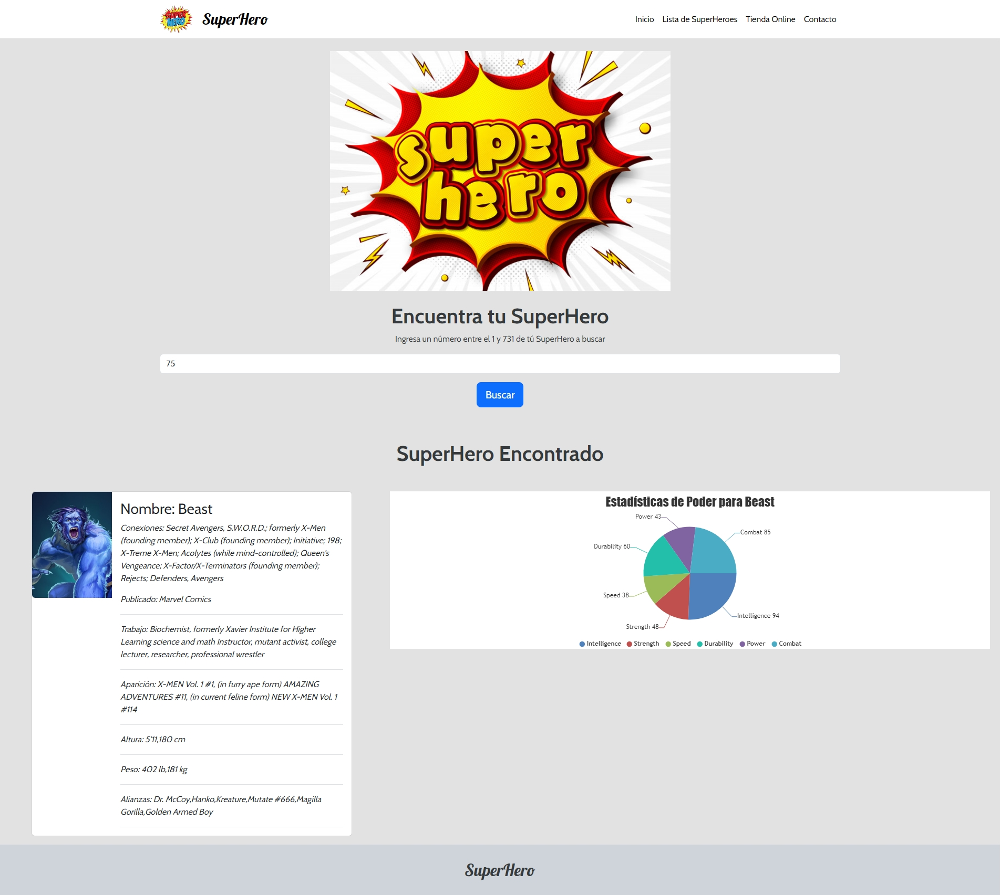

# Prueba - Encuentra tu SuperHero

En este desafío se ocupo Html5, Css3, Boostrap, JavaScript, Jquery, Canvasjs, SuperHero API

- Se creo la estructura básica para la pagina web implementando HTML, incluyendo un formulario de búsqueda.
- Se agrego estilos mediante frameworks y librerias de CSS

