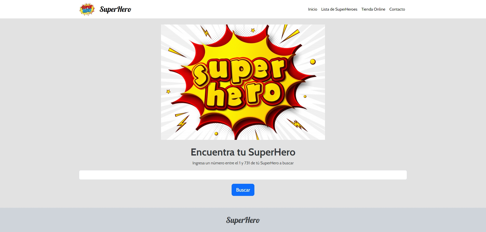

# Prueba Final módulo - SuperHero

## Descripción

El proyecto **SuperHero** es una aplicación web que permite a los usuarios buscar información sobre superhéroes. La página web está diseñada para permitir al usuario ingresar un número de superhéroe y, a partir de esa entrada, mostrar información detallada sobre el superhéroe encontrado, incluyendo estadísticas y gráficos relevantes.

## Vista Codificada

A continuación, se muestra la imagen del resultado codificado:

## Características

- **Búsqueda de Superhéroes**: Los usuarios pueden buscar un superhéroe ingresando un número entre 1 y 731.
- **Visualización de Información**: Una vez que se encuentra un superhéroe, se muestra una tarjeta con su información y estadísticas.
- **Gráficos de Estadísticas**: Se incluyen gráficos para visualizar estadísticas relacionadas con el superhéroe.

## Estructura del Proyecto

El proyecto se compone de las siguientes secciones:

Este archivo es el punto de entrada de la aplicación y contiene la estructura principal del HTML. Incluye:

- **Menú de Navegación**: Un menú que permite la navegación entre diferentes secciones del sitio.
- **Header**: Un encabezado con un campo de búsqueda para ingresar el número del superhéroe.
- **Sección de Resultados**: Donde se muestra la información del superhéroe encontrado y gráficos relacionados.
- **Footer**: Un pie de página simple con el nombre del proyecto.

## Requerimientos

- **HTML**: Utiliza etiquetas y estructuras básicas de HTML5.
- **CSS**: Utiliza Bootstrap 5 para la estructura y diseño, con estilos personalizados adicionales.
- **JavaScript**: Utiliza jQuery para manipulación del DOM y CanvasJS para generar gráficos.